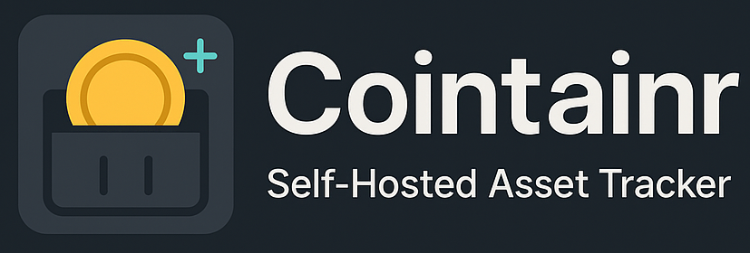

<div align="center">



_A modern, self-hosted portfolio tracking app with a focus on clarity, technology, and user data ownership._

[](https://hub.docker.com)
[](#license)
[](https://kit.svelte.dev)
[](https://fastapi.tiangolo.com)
[](https://www.typescriptlang.org)

</div>

---

## 📖 Overview

Cointainr is a self-hosted financial portfolio tracker that puts you in complete control of your data. Track stocks, cryptocurrencies, and cash holdings across multiple currencies with automatic price updates and intelligent caching. No third-party data sharing, no monthly fees - just your data, on your terms.

### ✨ Key Features

- **🔒 Self-Hosted & Private**: Your financial data stays on your infrastructure
- **💰 Multi-Asset Support**: Track stocks, ETFs, cryptocurrencies, and cash
- **🌍 Multi-Currency**: Support for EUR, USD, and other major currencies
- **📊 Real-Time Prices**: Automatic updates from Finnhub, CoinGecko, and Yahoo Finance APIs with intelligent fallback
- **⚡ Smart Caching**: Intelligent price caching to respect API limits
- **🎨 Modern UI**: Clean, responsive interface with dark mode
- **🐳 Docker Ready**: Single container deployment with docker-compose
- **📈 Portfolio Analytics**: Calculate profits, losses, and portfolio distribution

---

## 🚀 Quick Start

### Using Docker Compose (Recommended)

1. **Download the docker-compose.yml file**

   ```bash
   wget https://raw.githubusercontent.com/Flitschi7/cointainr/main/docker-compose.yml
   ```

2. **Edit the environment variables**
   Open `docker-compose.yml` and replace the placeholder API keys:

   ```yaml
   environment:
     - FINNHUB_API_KEY=your_finnhub_api_key_here
     - EXCHANGERATE_API_KEY=your_exchangerate_api_key_here
   ```

3. **Start the application**

   ```bash
   docker-compose up -d
   ```

4. **Open your browser** and navigate to `http://localhost:8000`

### API Keys Setup

**Finnhub API** (for stocks/ETFs):

- Sign up at [finnhub.io](https://finnhub.io/)
- Get your free API key (60 requests/minute)

**ExchangeRate API** (for currency conversion):

- Sign up at [exchangerate-api.com](https://exchangerate-api.com/)
- Get your free API key (1500 requests/month)

---

## ⚙️ Configuration

### Environment Variables

| Variable                     | Default | Description                                                 |
| ---------------------------- | ------- | ----------------------------------------------------------- |
| `FINNHUB_API_KEY`            | -       | **Required** - Finnhub API key for stock prices             |
| `EXCHANGERATE_API_KEY`       | -       | **Required** - ExchangeRate API key for currency conversion |
| `DEFAULT_CURRENCY`           | `EUR`   | Default display currency                                    |
| `PRICE_CACHE_TTL_MINUTES`    | `15`    | How long to cache stock/crypto prices                       |
| `CONVERSION_CACHE_TTL_HOURS` | `8`     | How long to cache currency rates                            |
| `FORCE_REFRESH_ONLY`         | `false` | Only fetch prices on manual refresh                         |
| `LOG_LEVEL`                  | `INFO`  | Logging level (DEBUG, INFO, WARNING, ERROR)                 |

### Cache Configuration

Cointainr uses intelligent caching to respect API rate limits:

- **Price Cache**: Stock and crypto prices are cached for 15 minutes by default
- **Conversion Cache**: Currency conversion rates are cached for 8 hours
- **Smart Refresh**: Automatic cache invalidation and background updates
- **Manual Override**: Force refresh button bypasses all caches

---

## 📱 Usage

### Adding Assets

1. **Cash Holdings**: Add bank accounts, savings, etc.

   - Name: "Savings Account"
   - Amount: 5000
   - Currency: EUR

2. **Stocks/ETFs**: Track individual positions

   - Symbol: "AAPL" or "A1JX52"
   - Quantity: 10 shares
   - Purchase Price: 150.00 (optional)

3. **Cryptocurrencies**: Monitor crypto positions
   - Symbol: "BTC", "ETH"
   - Quantity: 0.5
   - Purchase Price: 45000 (optional)

### Portfolio Dashboard

- **Total Value**: Real-time portfolio value in your base currency
- **Asset Breakdown**: Detailed view of all holdings
- **Profit/Loss**: Automatic calculation if purchase prices provided
- **Price Updates**: Smart caching with manual refresh option

---

## 🔒 Security & Privacy

### Data Protection

- **No Third-Party Analytics**: Zero external tracking
- **Local Data Storage**: All data stays on your infrastructure
- **API Key Security**: Environment-based configuration
- **HTTPS Ready**: TLS/SSL support for production deployments

## 📄 License

This project is open source and available under the [MIT License](LICENSE).
